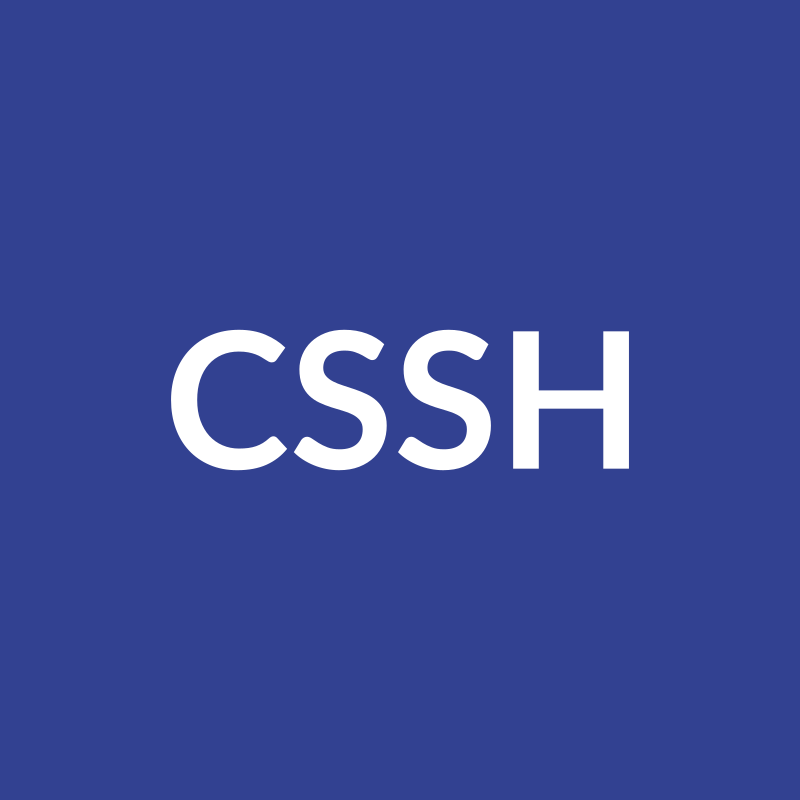

<div id="top"></div>

<br />
<div align="center">
  <a href="https://github.com/skryvvara/cssh">
      
  </a>

  <h3 align="center">CSSH - A TUI for ssh written in C++</h3>
  <h4 align="center">Checkout <a href="https://github.com/skryvvara/gossht">gossht</a> wich is a similar project to cssh written in <a href="https://go.dev">go</a></h4>
</div>

## Description

> ! This is a very early proof of concept

CSSH is a graphical ssh helper written in C++ using [ncurses](https://invisible-island.net/ncurses/).

## Build

You can build cssh using cmake

```sh
mkdir build
cd build

cmake ..
make

./cssh
```

## License

Gossht is licensed under the [MIT License](https://opensource.org/license/mit).
